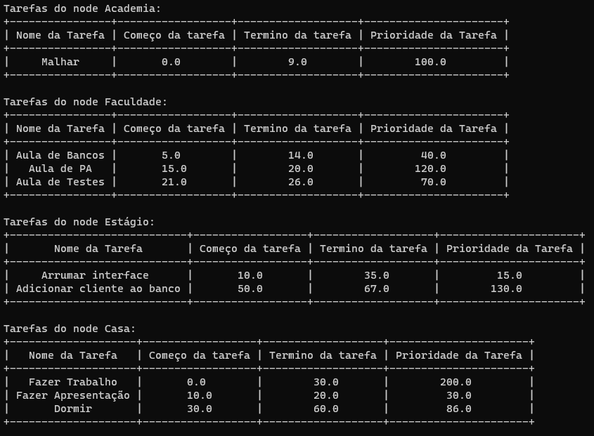
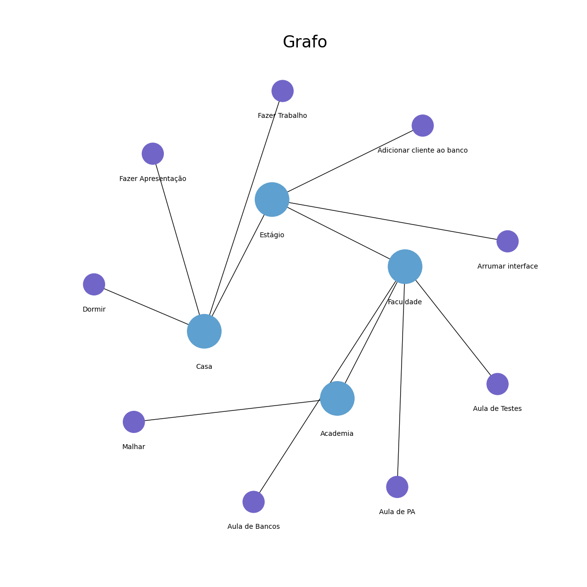
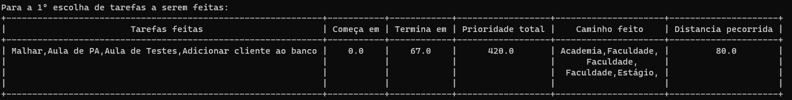
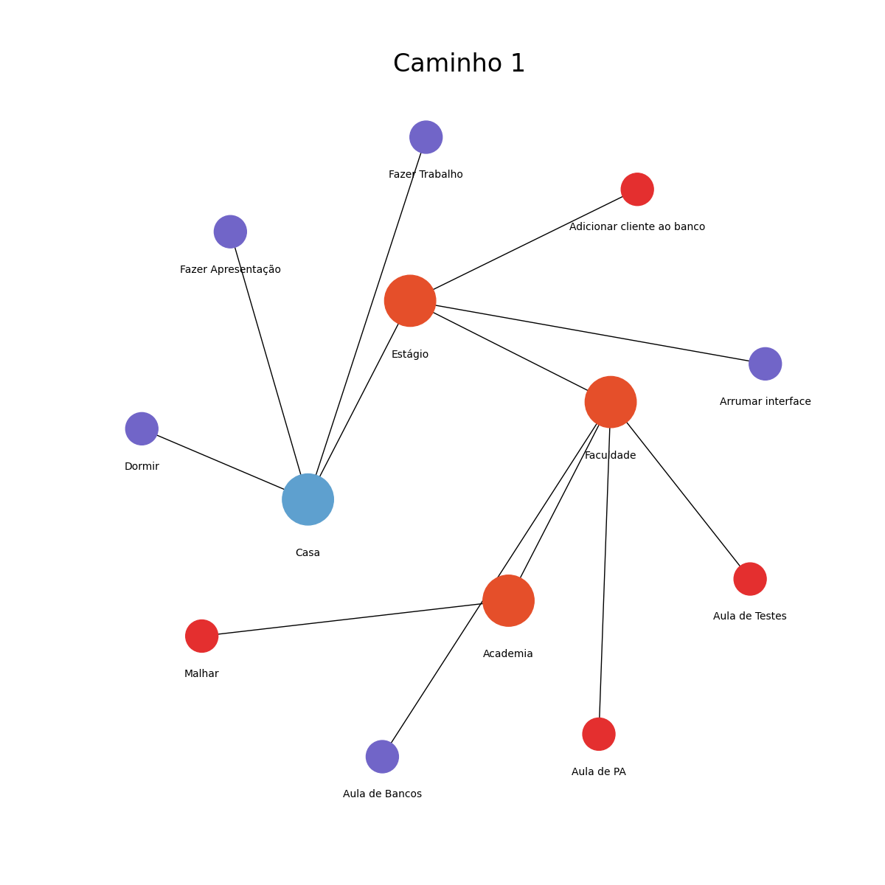
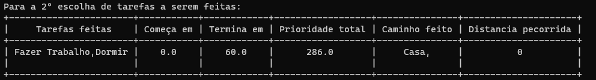
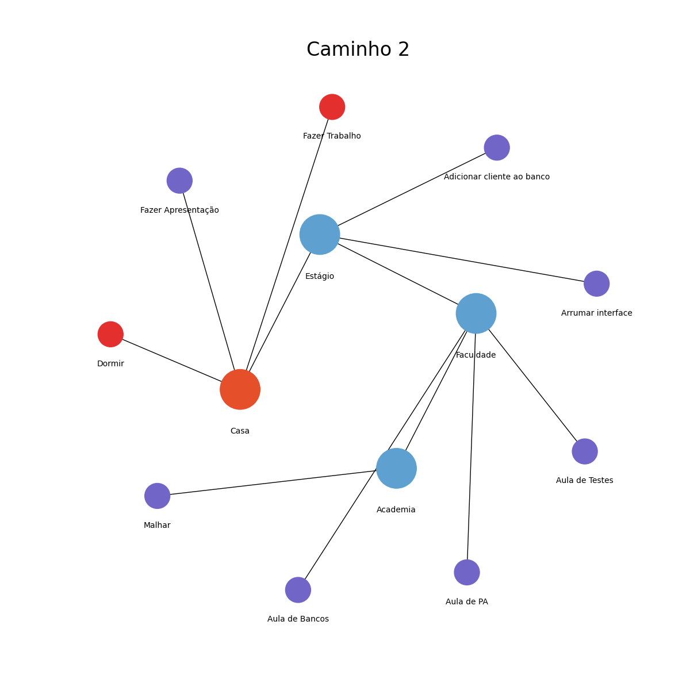
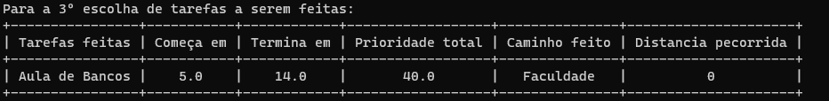
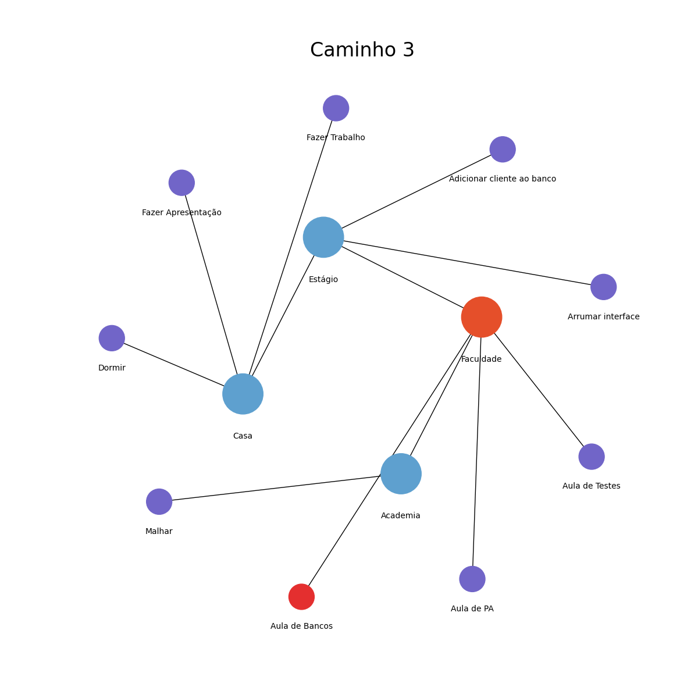
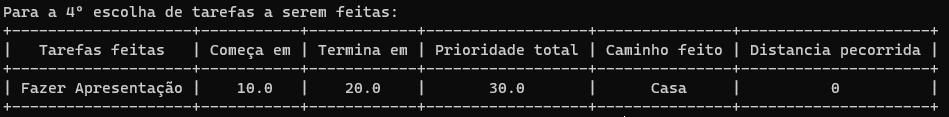
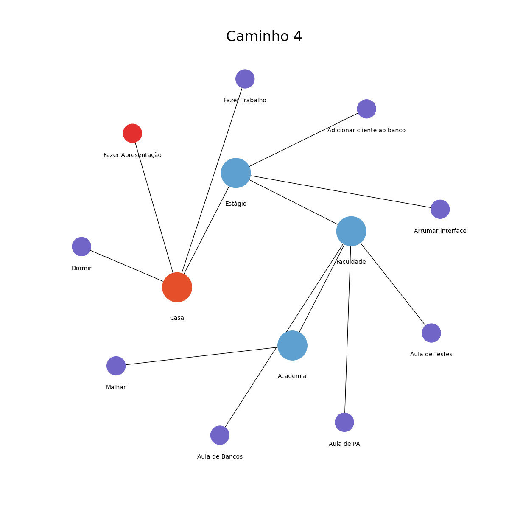

# Stone Way

**Número da Lista**: 1<br>
**Conteúdo da Disciplina**: Final<br>

## Alunos
|Matrícula | Aluno |
| -- | -- |
| 17/0122549  |  Paulo Gonçalves Lima |
| 17/0113060  |  Pedro Vítor de Salles Cella |

## Sobre 
O algoritmo desenvolvido serve para a criação de um Grafo de localizações com cada localização possuindo um conjunto de tarefas, utilizando de Bellman-Ford, criamos o  menor caminho possivel para as escolhas de tarefas possiveis, que o Weighted Interval Scheduling selecionar, assim por final tendo um plot do grafo e os caminhos possiveis na parte final.
## Screenshots
Utilizando o input 1 teremos, como resultado: <br>
Para as tarefas:<br>
<br>

Teremos o grafo:<br>

<br>
``` Nas representações dos grafos que escolhemos, os nodes no meio representam, as localizações de cada conjunto de tarefa, e os nodes nas borda são as tarefas que precisam ser feitas. ```

Ele vai fazer o calculo para cada conjunto de melhores escolhas:<br>

Para o 1º melhor subconjunto<br>
<br>

teriamos o grafo representante como:<br>
<br>

Para o 2º melhor subconjunto<br>
<br>

teriamos o grafo representante como:<br>
<br>

Para o 3º melhor subconjunto<br>
<br>

teriamos o grafo representante como:<br>
<br>

Para o 4º melhor subconjunto<br>
<br>

teriamos o grafo representante como:<br>
<br>

## Instalação 
**Linguagem**: Python<br>

<p>Para usar nosso projeto primeiro deve-se ter instalado o Python3 e uma biblioteca do Python chamada prettytable, siga as etapas:</p>
 
<p>Caso não tenha o Python3 instalado:</p>
 
```
sudo apt-get install python3
```
 
<p>Para instalar a biblioteca é bem simples, basta baixar pelo Linux ou baixar usando o pip</p>
 
Linux<br>
```
sudo apt-get install -y python3-prettytable
```
 
Pip<br>
```
python -m pip install -U prettytable
```
Ou
```
pip3 install prettytable
```

Networkx<br>
```
pip3 install networkx
```

Matplotlib<br>
```
pip3 install matplotlib
```

## Uso 
Apenas rode o comando:<br>
`python3 main.py`<br>

Para usar os inputs ja criados:<br>
Apenas rode o comando:<br>

`python3 main.py < input.txt`<br>

ou<br>

`python3 main.py < input2.txt`<br>

## Outros 
Quaisquer outras informações sobre seu projeto podem ser descritas abaixo.


